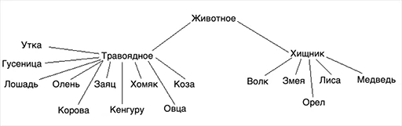

# Island4.0
modeling island model with animals

Проект представляет собой решение задачи итогового проекта модуля Java Core на JavaRush

<h3>Задание:</h3>

Твоя задача — запрограммировать модель острова с изменяемыми параметрами, состоящую из массива локаций (например, 100х20 клеток). Локации будут заполнены растительностью и животными. Животные могут:

есть растения и/или других животных (если в их локации есть подходящая еда),
передвигаться (в соседние локации),
размножаться (при наличии пары в их локации),
умирать от голода или быть съеденными.
ООП
Создавая разнообразие животных, нужно по максимуму использовать ООП: все виды будут происходить от одного абстрактного класса Animal, который будет содержать поведение, общее для всех животных. Если у конкретных животных будут особенности питания, размножения, передвижения и т. д., то для них нужно будет переопределить методы класса Animal.

Что нужно сделать:
1. Создай иерархию классов:

- **Хищник**: Волк, Удав, Лиса, Медведь, Орел

- **Травоядные**: Лошадь, Олень, Кролик, Мышь, Коза, Овца, Кабан, Буйвол, Утка, Гусеница

- **Растения**

В таблице ниже приведено, с какой вероятностью животное съедает "пищу", 
если они находятся на одной клетке. Давай посмотрим на ситуацию "волк ест кролика". 
В таблице число 60. Это означает, что волк может съесть кролика, если они на одной клетке, 
с вероятностью 60%. Нужно использовать многопоточный
random.

<table>
        <tbody>
            <tr>
                <th></th>
                <th>Волк</th>
                <th>Удав</th>
                <th>Лиса</th>
                <th>Медведь</th>
                <th>Орел</th>
                <th>Лошадь</th>
                <th>Олень</th>
                <th>Кролик</th>
                <th>Мышь</th>
                <th>Коза</th>
                <th>Овца</th>
                <th>Кабан</th>
                <th>Буйвол</th>
                <th>Утка</th>
                <th>Гусеница</th>
                <th>Растения</th>
            </tr>
            <tr>
                <th>Волк</th>
                <td>-</td>
                <td>0</td>
                <td>0</td>
                <td>0</td>
                <td>0</td>
                <td>10</td>
                <td>15</td>
                <td>60</td>
                <td>80</td>
                <td>60</td>
                <td>70</td>
                <td>15</td>
                <td>10</td>
                <td>40</td>
                <td>0</td>
                <td>0</td>
            </tr>
            <tr>
                <th>Удав</th>
                <td>0</td>
                <td>-</td>
                <td>15</td>
                <td>0</td>
                <td>0</td>
                <td>0</td>
                <td>0</td>
                <td>20</td>
                <td>40</td>
                <td>0</td>
                <td>0</td>
                <td>0</td>
                <td>0</td>
                <td>10</td>
                <td>0</td>
                <td>0</td>
            </tr>
            <tr>
                <th>Лиса</th>
                <td>0</td>
                <td>0</td>
                <td>-</td>
                <td>0</td>
                <td>0</td>
                <td>0</td>
                <td>0</td>
                <td>70</td>
                <td>90</td>
                <td>0</td>
                <td>0</td>
                <td>0</td>
                <td>0</td>
                <td>60</td>
                <td>40</td>
                <td>0</td>
            </tr>
            <tr>
                <th>Медведь</th>
                <td>0</td>
                <td>80</td>
                <td>0</td>
                <td>-</td>
                <td>0</td>
                <td>40</td>
                <td>80</td>
                <td>80</td>
                <td>90</td>
                <td>70</td>
                <td>70</td>
                <td>50</td>
                <td>20</td>
                <td>10</td>
                <td>0</td>
                <td>0</td>
            </tr>
            <tr>
                <th>Орел</th>
                <td>0</td>
                <td>0</td>
                <td>10</td>
                <td>0</td>
                <td>-</td>
                <td>0</td>
                <td>0</td>
                <td>90</td>
                <td>90</td>
                <td>0</td>
                <td>0</td>
                <td>0</td>
                <td>0</td>
                <td>80</td>
                <td>0</td>
                <td>0</td>
            </tr>
            <tr>
                <th>Лошадь</th>
                <td>0</td>
                <td>0</td>
                <td>0</td>
                <td>0</td>
                <td>0</td>
                <td>-</td>
                <td>0</td>
                <td>0</td>
                <td>0</td>
                <td>0</td>
                <td>0</td>
                <td>0</td>
                <td>0</td>
                <td>0</td>
                <td>0</td>
                <td>100</td>
            </tr>
            <tr>
                <th>Олень</th>
                <td>0</td>
                <td>0</td>
                <td>0</td>
                <td>0</td>
                <td>0</td>
                <td>0</td>
                <td>-</td>
                <td>0</td>
                <td>0</td>
                <td>0</td>
                <td>0</td>
                <td>0</td>
                <td>0</td>
                <td>0</td>
                <td>0</td>
                <td>100</td>
            </tr>
            <tr>
                <th>Кролик</th>
                <td>0</td>
                <td>0</td>
                <td>0</td>
                <td>0</td>
                <td>0</td>
                <td>0</td>
                <td>0</td>
                <td>-</td>
                <td>0</td>
                <td>0</td>
                <td>0</td>
                <td>0</td>
                <td>0</td>
                <td>0</td>
                <td>0</td>
                <td>100</td>
            </tr>
            <tr>
                <th>Мышь</th>
                <td>0</td>
                <td>0</td>
                <td>0</td>
                <td>0</td>
                <td>0</td>
                <td>0</td>
                <td>0</td>
                <td>0</td>
                <td>-</td>
                <td>0</td>
                <td>0</td>
                <td>0</td>
                <td>0</td>
                <td>0</td>
                <td>90</td>
                <td>100</td>
            </tr>
            <tr>
                <th>Коза</th>
                <td>0</td>
                <td>0</td>
                <td>0</td>
                <td>0</td>
                <td>0</td>
                <td>0</td>
                <td>0</td>
                <td>0</td>
                <td>0</td>
                <td>-</td>
                <td>0</td>
                <td>0</td>
                <td>0</td>
                <td>0</td>
                <td>0</td>
                <td>100</td>
            </tr>
            <tr>
                <th>Овца</th>
                <td>0</td>
                <td>0</td>
                <td>0</td>
                <td>0</td>
                <td>0</td>
                <td>0</td>
                <td>0</td>
                <td>0</td>
                <td>0</td>
                <td>0</td>
                <td>-</td>
                <td>0</td>
                <td>0</td>
                <td>0</td>
                <td>0</td>
                <td>100</td>
            </tr>
            <tr>
                <th>Кабан</th>
                <td>0</td>
                <td>0</td>
                <td>0</td>
                <td>0</td>
                <td>0</td>
                <td>0</td>
                <td>0</td>
                <td>0</td>
                <td>50</td>
                <td>0</td>
                <td>0</td>
                <td>-</td>
                <td>0</td>
                <td>0</td>
                <td>90</td>
                <td>100</td>
            </tr>
            <tr>
                <th>Буйвол</th>
                <td>0</td>
                <td>0</td>
                <td>0</td>
                <td>0</td>
                <td>0</td>
                <td>0</td>
                <td>0</td>
                <td>0</td>
                <td>0</td>
                <td>0</td>
                <td>0</td>
                <td>0</td>
                <td>-</td>
                <td>0</td>
                <td>0</td>
                <td>100</td>
            </tr>
            <tr>
                <th>Утка</th>
                <td>0</td>
                <td>0</td>
                <td>0</td>
                <td>0</td>
                <td>0</td>
                <td>0</td>
                <td>0</td>
                <td>0</td>
                <td>0</td>
                <td>0</td>
                <td>0</td>
                <td>0</td>
                <td>0</td>
                <td>-</td>
                <td>90</td>
                <td>100</td>
            </tr>
            <tr>
                <th>Гусеница</th>
                <td>0</td>
                <td>0</td>
                <td>0</td>
                <td>0</td>
                <td>0</td>
                <td>0</td>
                <td>0</td>
                <td>0</td>
                <td>0</td>
                <td>0</td>
                <td>0</td>
                <td>0</td>
                <td>0</td>
                <td>0</td>
                <td>-</td>
                <td>100</td>
            </tr>
        </tbody>
    </table>

Характеристики животных:

<table>
        <tbody>
            <tr>
                <th></th>
                <th>Вес одного животного, кг</th>
                <th>Максимальное количество животных этого вида на одной клетке</th>
                <th>Скорость перемещения, не более чем, клеток за ход</th>
                <th>Сколько килограммов пищи нужно животному для полного насыщения</th>
            </tr>
            <tr>
                <th>Волк</th>
                <td>50</td>
                <td>30</td>
                <td>3</td>
                <td>8</td>
            </tr>
            <tr>
                <th>Удав</th>
                <td>15</td>
                <td>30</td>
                <td>1</td>
                <td>3</td>
            </tr>
            <tr>
                <th>Лиса</th>
                <td>8</td>
                <td>30</td>
                <td>2</td>
                <td>2</td>
            </tr>
            <tr>
                <th>Медведь</th>
                <td>500</td>
                <td>5</td>
                <td>2</td>
                <td>80</td>
            </tr>
            <tr>
                <th>Орел</th>
                <td>6</td>
                <td>20</td>
                <td>3</td>
                <td>1</td>
            </tr>
            <tr>
                <th>Лошадь</th>
                <td>400</td>
                <td>20</td>
                <td>4</td>
                <td>60</td>
            </tr>
            <tr>
                <th>Олень</th>
                <td>300</td>
                <td>20</td>
                <td>4</td>
                <td>50</td>
            </tr>
            <tr>
                <th>Кролик</th>
                <td>2</td>
                <td>150</td>
                <td>2</td>
                <td>0,45</td>
            </tr>
            <tr>
                <th>Мышь</th>
                <td>0.05</td>
                <td>500</td>
                <td>1</td>
                <td>0.01</td>
            </tr>
            <tr>
                <th>Коза</th>
                <td>60</td>
                <td>140</td>
                <td>3</td>
                <td>10</td>
            </tr>
            <tr>
                <th>Овца</th>
                <td>70</td>
                <td>140</td>
                <td>3</td>
                <td>15</td>
            </tr>
            <tr>
                <th>Кабан</th>
                <td>400</td>
                <td>50</td>
                <td>2</td>
                <td>50</td>
            </tr>
            <tr>
                <th>Буйвол</th>
                <td>700</td>
                <td>10</td>
                <td>3</td>
                <td>100</td>
            </tr>
            <tr>
                <th>Утка</th>
                <td>1</td>
                <td>200</td>
                <td>4</td>
                <td>0,15</td>
            </tr>
            <tr>
                <th>Гусеница</th>
                <td>0.01</td>
                <td>1000</td>
                <td>0</td>
                <td>0</td>
            </tr>
            <tr>
                <th>Растения</th>
                <td>1</td>
                <td>200</td>
                <td>N/A</td>
                <td>N/A</td>
            </tr>
        </tbody>
    </table>

2. У животного должны быть методы: покушать,
   размножиться,
   выбрать направление передвижения.

3. В классах травоядного и хищника можно реализовать метод покушать. 
Но обрати внимание, есть травоядное утка, которое ест гусеницу.

4. В конкретных классах того или иного вида можно дорабатывать все методы под особенности животного.

5. Должно быть создано минимум 10 видов травоядных и 5 видов хищников (описаны в п. 1).

<h3>**Многопоточность**</h3>

Конечно, можно написать всю программу в одном потоке, используя только циклы. 
Но нам нужно практически поработать с многопоточностью, поэтому обязательно нужно
использовать потоки и пулы потоков. Один scheduled пул — для запуска по расписанию 
задания роста растений, задания жизненного цикла животных, и задания вывода статистики
по системе. Как вариант, можно выводить статистику в одном задании с растениями или 
животными. Внутри задания жизненного цикла животных можно использовать еще один пул 
потоков — обычный. Какие задачи отдавать на выполнение этому пулу — решай самостоятельно.

<h4>**Обязательная часть задания:**</h4>

- Иерархия животных (ООП)
- Поведение животных
- Многопоточность
- Статистика по состоянию острова на каждом такте (в консоль)

<h4>**Опциональная часть задания:**</h4>

- Вынести параметры в одно место, чтоб было удобно управлять “симуляцией”
- Графика вместо консольной статистики. Это может быть как псевдо-графика в консоли, так и JavaFX, Swing…
- Добавь другие факторы, которые могут влиять на симуляцию:
  - больше видов животных
  - разные виды растений
  - кастомное поведение для группы животных (к примеру, волки охотятся и передвигаются не по одному, а стаей)
  - рельеф на земле, в том числе река, которая препятствует передвижению некоторых животных

<h3>О параметрах (если решишь делать)</h3>
Чтобы при запуске программы было удобно менять различные ее параметры
(размер острова, максимально допустимое количество растений/животных в одной клетке, 
вероятность передвижения того или иного вида животных, количество приплода у различных 
видов и т. д.), нужно все эти параметры вынести куда-то, например, в отдельный класс. 
Должна быть возможность изменять следующие параметры:

- размер острова
- длительность такта симуляции
- количество животных каждого вида на старте симуляции
- условие остановки симуляции (например, умерли все животные)
- количество детенышей у каждого вида животных
- 
<h3>Юникод (если решишь делать псевдографику)</h3>

Для изображения животных можно использовать юникод символы: 🐃, 🐻, 🐎, 🦌, 🐗, 🐑, 🐐, 🐺, 🐍, 🦊, 🦅, 🐇, 🦆, 🐁, 🐛.